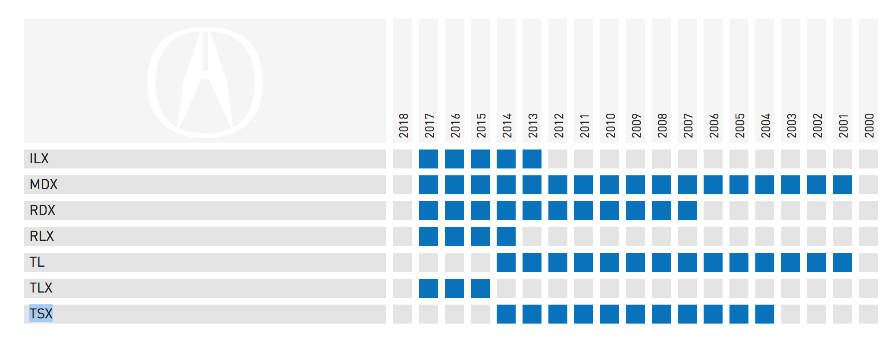

# Full-Stack Short test

This test will evaluate your front-end and back-end skills.

It will take at least 2 hours but no more than 4 to complete the test.

## Structure of the repository

```
.
├── Readme.md                           # Readme
├── back-end                            # Contain the back-end stack in various languages to create the api
│    ├── golang                         # stack in golang (Framework Gin)
│    ├── php                            # stack in PHP 7 (Framework Slim)
│    ├── python                         # stack in Python (Framework Flask/SqlAlchemy)
│    └── Readme.md                      # Back-End Readme
│
├── data                                # The data
│    ├── postman                        # Postman file (collection)
│    │      └── collection.json         # The postman collection of the back-end api
│    ├── mockup.png                     # Mockup of the UI to create
│    └── mpd.png                        # Structure of the database
│
├── database                            # The database in MySQL
│    ├── Readme.md                      # The readme explain how to run/stop/update the database
│    └── sql                            # Script to created the database, add fixtures,...
└── front-end                           # Stack of the Front-End (React.js)
```


## Back-End (BE) Tasks

Develop the following tasks in the language you prefer (PHP, Goland or Python). A stack is available for each of these languages in the folder `back-end`.


* TASK 1: As a user, I want to list all the vehicle model by vehicle make (Ex. Acura) to be able to define the row header of the grid
  - Implement a new endpoint to do this action

* TASK 2: As a user, I want to list all the vehicle years available to be able to define the column header of the grid
  - Implement a new endpoint to do this action

* TASK 3: As a user, I want to get the list of vehicle to be able to fill up the grid with the proper colors.
  - Implement a new endpoint to do this action

Example of response: (List of the years available by model for the make "Acura")
```json 
 {
  "coverage": {
    "ILX": [2017, 2016, 2015, 2014],
    "MDX": [2017, 2016, 2015, 2014],
    "RDX": [2011, 2010],
    "RLX": [2012, 2011, 2010],
    "TL": [2014, 2013, 2012, 2011, 2010],
    "TLX": [2016, 2015, 2014, 2013],
    "TSX": [2017, 2015]
  }
}
```
Note: You are free to structure the response as needed.

* TASK 4: As a user, I want to be able to remove a vehicle from the coverage (model/year)
  - Update the database migration script `database/sql/update_database.sql` add a column `state` in all the tables existing. This column can take 2 values 0/1. (0 means the entry has been turn off)
  - Update the database migration script `database/sql/update_database.sql` add a column `updated` in all the tables existing. (This column contain the date and the time when the data has been changed)
  - Implement a new endpoint to do this action

Extra tasks:

* TASK 5: Secure the calls with a JWT token
* TASK 6: Add some Unit Test

## Front-End (FE) Tasks

* A single page "app" that displays years (BE Task #2) and vehicle models (BE Task #1) for the vehicle make __"Acura"__ in a grid format. The data are coming from an API that you will develop (Back-End Tasks).
* A grid with the contents of `years` and `vehicle-models` (as in the mockup below).



* Set the corresponding box to be blue if the entry for that vehicle model and year exists. And grey if it doesn't exist. (An api call will be necessary BE Task #3)
* When clicking on a vehicle-model/year box, it is toggled and the visual displays the new state. (An api call will be necessary to be able to update the state in the database, BE Task #4)

### Example

Once the list of vehicles are loaded into the grid (BE Task #3)

- The years for the RLX are `"coverage":{"RLX":[2012,2011,2010]}`
- After clicking on the 2013 column next to RLX: `"coverage":{"RLX":[2013,2012,2011,2010]}`
- The visual should now show a blue box for the year 2013 next to RLX.
- Clicking on the 2010 column next to RLX:
  `"coverage":{"RLX":[2013,2012,2011]}`
- The visual should now show a grey box for the year 2010 next to RLX.


## How to submit your work?

Submit your work preferably on a github account else zip the source and send it by email.

## Evaluation

This will be evaluated on the compliance to the supplied visual (mockup.png), and the code quality.

You will have the opportunity to justify your decisions during the interview.
