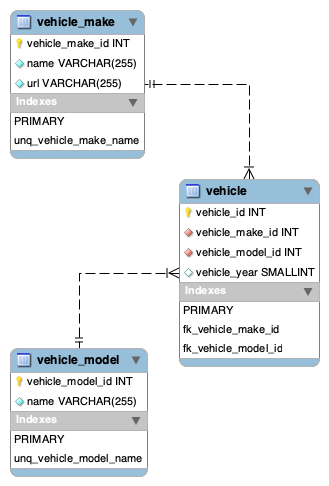

Database - Mysql
==========================

## Requirements

* You need to install docker desktop and Sign Up [Download Docker](https://www.docker.com/products/docker-desktop)

## Structure of the project

```
database
├── Readme.md                      # Readme
├── sql                            # Folder of sql files use by MySQL
│    ├── create_database.sql       # SQL file to create the database
│    ├── load_fixtures.sql         # SQL file to load the fixtures
│    └── update_database.sql       # SQL file to ypdate the database
│
├── docker-compose.yml             # Docker Compose for the database MySQL
└── runmysql.sh                    # Script to run/stop MySQL
```

### Database Structure



## Start/Stop MySQL

1) Start the database MySQL
```
./runmysql.sh  #Choose start in the contextual menu
```

2) Stop the database MySQL
```
./runmysql.sh  #Choose stop in the contextual menu
```

3) Stop and Purge the database MySQL
```
./runmysql.sh  #Choose purge in the contextual menu
```

**IMPORTANT**: Everytime you modify the file `sql/update_database.sql` you have to run the script `runmysql.sh` with the command *purge*

Note: You can apply directly your SQL queries to test them in your favorite Mysql UI by using the credentials.

## Credentials Database

``` 
USER: usrtest
PASSWORD: pwdtest
ROOT_PASSWORD: pwdtest
DATABASE: local_dbtest
```
